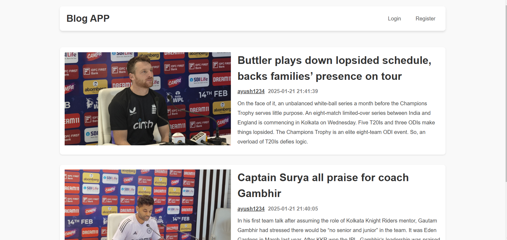

# Blog-App
Blog App

Description

This Blog App is built using the MERN (MongoDB, Express.js, React.js, Node.js) stack. It allows users to register, log in, create posts, and view blog posts on the home page. The app ensures a smooth user experience with a responsive and modern UI.

Features

User Registration: Secure user sign-up with form validation.

User Login: Authentication for registered users.

Create a Post: Authenticated users can create and publish blog posts.

Home Page: Displays all blog posts with details like title, author, and summary.

This is a screenshot of the application:

Pages

1. Login Page

Allows existing users to log in.

Validates user credentials against the database.

Redirects to the Home page upon successful login.

2. Sign-Up Page

Enables new users to register.

Ensures unique usernames and valid data input.

Stores user information securely in the database.

3. Create Post Page

Available only to logged-in users.

Provides a form for creating a blog post with fields like title, content, and optional tags.

Saves the post to the database and displays it on the Home page.

4. Home Page

Displays a list of all blog posts.

Includes the post title, author name, and a summary.

Links to individual blog post pages for detailed viewing.

Technology Stack

Frontend

React.js: For building a responsive and dynamic user interface.

CSS: For styling the components.

Backend

Node.js: For server-side logic and API handling.

Express.js: For creating RESTful API endpoints.

Database

MongoDB: For storing user data and blog posts.

Additional Tools

Mongoose: For MongoDB object modeling.

JWT (JSON Web Token): For user authentication.

Bcrypt: For hashing user passwords.
